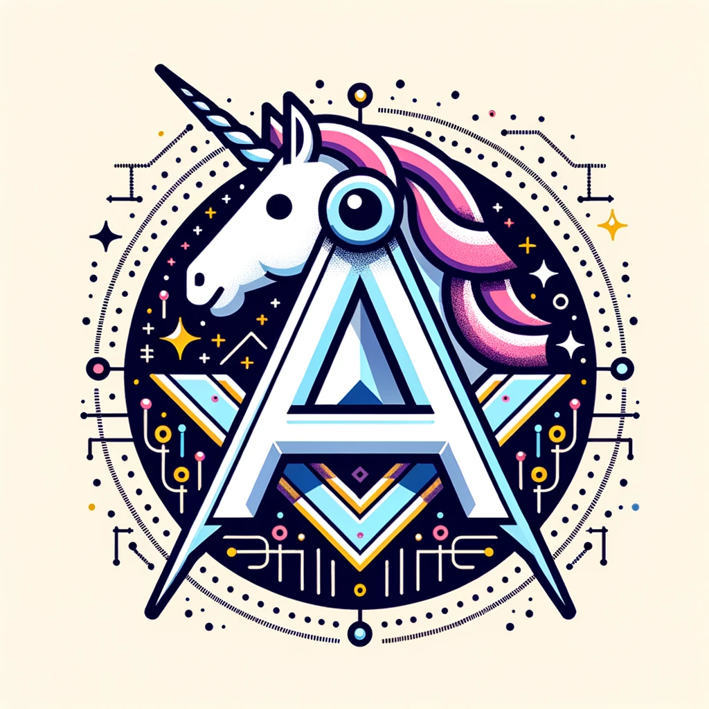

#### Active Project

- [Short URL](https://github.com/supanadit/short-url) Bit.ly Alternative - Laravel
- [Todo](https://github.com/supanadit/todo) Simple Todo App - Laravel
- [Restsuite V2](https://github.com/supanadit/restsuite-v2) Rest API Testing - Kotlin Desktop / Jetbrains Compose + Swing
- [Geo Smart System](https://github.com/supanadit/geo-smart-system) Tracking System - Go
- [Geo Smart Map](https://github.com/supanadit/geosmartmap) Live Map Tracking System for Geo Smart System - Angular
- [Geo Smart App](https://github.com/supanadit/geo-smart-app) Mobile Tracking System for Geo Smart System - Flutter
- [JWT Go](https://github.com/supanadit/jwt-go) JWT Handling for Golang - Go
- [Mathics](https://github.com/supanadit/mathics) Mathematics Operation for Golang - Go
- [Media](https://github.com/supanadit/media) Sharing public folder with Golang - Go

#### Archived / Discontinue / Pending Project

- [Factory](https://github.com/supanadit/factory) Tools for DevOps - Go
- [Restsuite](https://github.com/supanadit/restsuite) Rest API Testing - Java Desktop
- [Operation X Backend](https://github.com/supanadit/operation-x-backend) CI/CD Tools - NodeJS / Express
- [Operation X Frontend](https://github.com/supanadit/operation-x-frontend) UI Management Tools for Operation X - Angular
- [Stay](https://github.com/supanadit/stay) Package manager for Golang - Go
